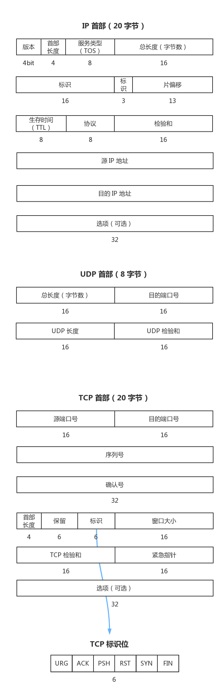

#系统学习笔记
##TCP/IP 协议族简介
###概述
虽然计算机的型号、种类、操作系统各不相同，但是他们可以依据一套相同的协议进行通信，这套协议就是起源于上世纪 60 年代的 TCP/IP 协议，通过这套协议组成的网络就是遍布世界的因特网
###TCP/IP 分层
在之前的日志中，我们介绍了计算机网络的 OSI 分层模型和互联网网际协议分层。

TCP 和 UDP 作为最著名的传输层协议，都是使用 IP 作为网络层协议的，而 IP 协议则是一个不可靠的网络层协议，他并不保证数据报传输的安全无误

有很多应用程序使用 TCP 或 UDP 协议进行通讯，但是却很少有应用直接使用 IP 协议进行通信的，TCP、UDP、IP 都有很多附属协议，ICMP 就是 IP 协议的一个附属协议，虽然 ICMP 主要供 IP 使用，但是也有应用程序直接使用它，比如 Ping 和 Traceroute

IGMP 是 Internet 组管理协议，它是用来把一个 UDP 数据报多播到多个主机

 

事实上，互联网的目的之一就是在应用程序中隐藏物理细节，因此，在上图中，越是下层的协议越接近物理细节，也越少有用户或协议调用或关心，上层协议对下层协议进行了封装和隐藏

最底层的链路层就是与传输媒介相互通信的硬件接口和某些网络接口使用的特殊协议，如 ARP（地址解析协议）和 RARP（逆地址解析协议），他们主要用来转换 IP 层和网络接口层使用的地址
###互联网地址与域名
互联网上每个接口必须有一个唯一的地址，这个地址就是 IP 地址，对于 IPv4 版本的 IP 地址，由一个 32bit 的数字来表示，他通常被按照每 8 位为单位划分成 4 个部分，每部分的 8bit 被转换成一个十进制数字，也就是点分十进制的表示

随着互联网资源的不断增长，IPv4 的 32bit 数已经无法表示全部有效的地址了，因此，IPv4 的下一版本 IPv6 应运而生，他由 128 位构成

由于 IP 地址不便于记忆，人们通常使用主机名对网络上的主机进行标识，这些主机名就是所谓的“域名”，域名系统就是 DNS，是一个分布式数据库，存储了域名与 IP 地址之间的关系，以便对他们进行映射和转换
###封装
当应用程序使用 TCP 协议传输数据时，数据被送入协议栈中，然后逐个通过每一层直到完成完整的封装，并以一串比特流的形式送入网络，这个通过以太网传输的比特流被称作帧（Frame），而 IP 传给网络接口层的数据单元被称为 IP 数据报，TCP 传给 IP 的数据单元则称为 TCP 报文段（简称 TCP 段）

发送主机进行上述的封装后就可以向以太网上的目的主机发送相应的以太网帧了

当目的主机接收到以太网帧时，他需要从协议栈中由底向上检测并去掉各层协议的首部，这个过程就被称为“分用”
###IP、UDP、TCP 首部

###TCP/UDP选用原则
1. 实时音视频是可以而且应该用 UDP 的，一方面因为它常常涉及到网络穿透，另外一方面它不需要重传。——我需要实时的看到你的图像跟声音，至于中间丢一帧什么的完全不重要。而为了重传往往会造成延迟与不同步，考虑一下，某一帧因为重传，导致0.5秒以后才到，那么整个音视频就延迟了0.5秒。考虑一下接收方看视频，如果使用 TCP 导致视频的中间延迟了0.5秒，只要我不按「快进」键，那么后续的视频全都会比发送方延迟0.5秒。这种延迟是累加的，随着持续丢帧，延迟会越来越大，达到数秒，甚至分钟级，这会严重影响实时音视频的用户体验。因此<b>「实时音视频聊天」功能通常都会使用 UDP 实现</b>。

2. 网络真的非常非常可靠，以至于你完全不需要考虑 UDP 丢包问题的情况。
典型的例子应该是专门为有线局域网设计的协议。

3. 另外一个问题是 TCP 是纯粹的流式数据，所以制定传输协议的时候，接受方需要自行判定一个包的开始和结束，因为你完全可能接受到半个包或者两个包。——如果数据报的起止判定对你具体的程序会成为大问题，也可以考虑 UDP。

在互联网技术中，UDP常用在缓存读取，保存；用在监控或终端上报；常用dns服务，SNMP协议都是UDP协议的。

1. TCP是流式协议，即数据包是没有边界的，需要自己识别（这个pansz已经提到）。可以把发TCP数据包的动作理解成往对端用管子灌水。水就是数据包，它们之间没有边界；UDP是面向消息的，每个包是有边界的。可以把发UDP数据包的动作理解成往对端滚玻璃球。每个玻璃球是一个数据包，它们之间有明显的边界。而且由于每个玻璃球的速度可能不一样，先滚的不一定先到，所以需要自己处理乱序。

2. UDP比TCP效率高些。道理很简单啊，TCP要检查丢没丢包等额外的工作。

3. TCP也是可以做NAT穿透的哈（俗称打洞）。 
####总结：
- UDP的特性是：数据报，无连接，简单，不可靠，会丢包，会乱序（实际中遇到的主要是丢包）
- TCP的特性是：流式，有连接，复杂，可靠，延迟较大、带宽占用较大（均是相对于UDP来说）
###OSI开放系统互连参考模型
开放系统互连参考模型 (Open System Interconnect 简称OSI）是国际标准化组织(ISO)和国际电报电话咨询委员会(CCITT)联合制定的开放系统互连参考模型，为开放式互连信息系统提供了一种功能结构的框架。它从低到高分别是：物理层、数据链路层、网络层、传输层、会话层、表示层和应用层。

- 1、国际标准化组织ISO在1979年建立了一个分委员会来专门研究一种用于开放系统的体系结构，提出了开放系统互连OSI模型，这是一个定义连接异种计算机的标准主体结构。
- 2、OSI简介：OSI采用了分层的结构化技术，共分七层，物理层、数据链路层、网络层、传输层、会话层、表示层、应用层。
- 3、OSI参考模型的特性：是一种异构系统互连的分层结构；提供了控制互连系统交互规则的标准骨架；定义一种抽象结构，而并非具体实现的描述；不同系统中相同层的实体为同等层实体；同等层实体之间通信由该层的协议管理；相信层间的接口定义了原语操作和低层向上层提供的服务；所提供的公共服务是面向连接的或无连接的数据服务；直接的数据传送仅在最低层实现；每层完成所定义的功能，修改本层的功能并不影响其他层。
- 4、物理层：提供为建立、维护和拆除物理链路所需要的机械的、电气的、功能的和规程的特性；有关的物理链路上传输非结构的位流以及故障检测指示。
- 5、数据链路层：在网络层实体间提供数据发送和接收的功能和过程；提供数据链路的流控。
- 6、网络层：控制分组传送系统的操作、路由选择、拥护控制、网络互连等功能，它的作用是将具体的物理传送对高层透明。
- 7、传输层：提供建立、维护和拆除传送连接的功能；选择网络层提供最合适的服务；在系统之间提供可靠的透明的数据传送，提供端到端的错误恢复和流量控制。
- 8、会话层：提供两进程之间建立、维护和结束会话连接的功能；提供交互会话的管理功能，如三种数据流方向的控制，即一路交互、两路交替和两路同时会话模式 。
- 9、表示层：代表应用进程协商数据表示；完成数据转换、格式化和文本压缩。
- 10、应用层：提供OSI用户服务，例如事务处理程序、文件传送协议和网络管理等。

##在当前网络环境下（2016年），手游使用长连接（TCP）好还是短连接（HTTP）好？
###先简单的介绍一下计算网络的一些基础知识：
首先说一下 tcp:tcp的好处就是“可靠”，会将体积大的数据包进行分片，保证不会让ip协议进行分片。会检测数据包是否丢包，丢包重传，有序地发送数据包等等，坏处就是数据包头比较臃肿，至少有20+的字节（不要小看这20+字节),在丢包重传时，会阻塞后面的数据包，而且tcp需要保持连接状态才能进行通讯，在连接数较多时，服务器光在handle这些连接状态上就要消耗不少的性能。题主所说的“长连接”应该指的是tcp socket，tcp socket是操作系统为tcp协议的实现（说白了就是操作系统为tcp提供的api) 
http: http处于应用层，是基于tcp的实现。它继承了tcp的所有优点。跟tcp有些不同,http不会一直的保持连接状态，在早期的http 1.0时期，http请求在得到响应后会立即断开连接，这样就导致了每次的http请求都必须去进行tcp握手（在数据报文很小时，握手时间甚至会超过数据传送时间），在1.1版本后使用同一个连接进行多次的http请求，在一段时间内没有再次进行http请求时，会自动断开，这样就减轻了服务器维护大量链接所产生的开销问题，但是http是应用层，它会产生新的数据报头，在数据包的容量上会更大。
在说一下题主这里没有提到的udp: udp 是“不可靠”的：不会丢包重传，会导致ip分片从而丢包，数据包不会按序送达，只保证到达的包数据是完整的，它的好处就是,不会产生tcp丢包时的队列阻塞，数据报头较小，只有8个字节，是一个无连接协议。

###手游用什么协议？有啥优缺点？
- tcp：优点就是tcp的功能太强大了，基本上没有tcp做不了的事，而且基于tcp的第三方库也非常多而且稳定，开发起来比较顺心。但tcp的缺点也很多，数据报头有20+字节，在一些动作类游戏中，需要非常频繁地与服务器进行交互，而且通常一个操作指令会很小（基本上都小于20个字节 :P),这就代表一半的带宽开销被用在了数据报头上。其次就是tcp需要保持连接状态，这个在pc上可能不是问题，在手机上问题就大了。手机信号不稳定，ios操作系统会将后台非特殊进程挂起，导致游戏断线需要断线重连，也就是重新登陆一次，做过网游的同学都知道，游戏登陆操作对服务器的开销往往是最大的。再一个就是tcp丢包重传的特性引起的，每次发送数据包需要check是否包已到达，队列后的数据包需要等待前一个数据包成功发送后才能进行发送，这样会导致严重的lag，在手机信号不好时尤为明显。由于大量的tcp连接会带来开销，基于tcp的游戏通常在线人数会有limit,当然，使用分布式架构或者游戏滚服会解决掉这个问题（tcp分布式架构人人都会做，做的好不好，这个得看功力）。
- http：因为http不需要持续地保持连接，是一个无状态的连接，不会产生tcp所产生的断线重连的问题，服务器也不需要维护过多的连接。缺点就是需要经常的进行tcp握手操作（不会影响玩家体验），而且由于http的无状态性，通常游戏数据需要实时保存，不过现在的内存数据库 nosql的兴起和计算机性能的提升，这块劣势已经不存在，而且越来越多的游戏都采用实时数据保存，防止游戏服务器宕机数据回档的风险。再一个就是服务器无法主动向客户端推送数据，导致在某些功能上会无法实现。由于http的无状态性，需要做心跳处理，基于http的游戏服务器可以横向扩展（每一个游戏服务器进程就是一个单纯的逻辑计算器），数据库架构设计的好的话，一个游戏服很容易实现1亿+的玩家同服的情况。
- udp：优点就是“快”和“小”，udp不会产生tcp的数据包队列阻塞的问题，而且报头数据量很小，在某些对速度和网络io量有较大要求的玩法时，这2个优点显得尤为重要，而且udp是无连接的，不会产生断线问题，也可以横向扩展。缺点就是udp的不可靠性，一些实现可靠的udp协议的第三方库很少，而且往往满足不了自己项目的需求，所以要实现可靠的udp要自己动手造一遍轮子，需要一定的网络基础知识和敢于踩坑的精神 :P 
###我的推荐 
- 方案1 ：完全使用udp，几个项目下来，我觉得使用udp做手游服务端真的是perfect match。没有断线问题，流量小，响应速度快。无奈手游环境开发商们心态比较浮躁，都以稳定来追求利益最大化，市面上完全使用udp的游戏非常少。
- 方案2 ：http+udp，这种相对保守一些，逻辑相关的使用http协议，保证游戏逻辑不会出通讯上的问题，推送类的使用udp，比如聊天，世界公告等等，这些就算你的udp协议写的烂，也不会产生严重问题。如果实时性要求非常高的战斗功能，请使用udp。